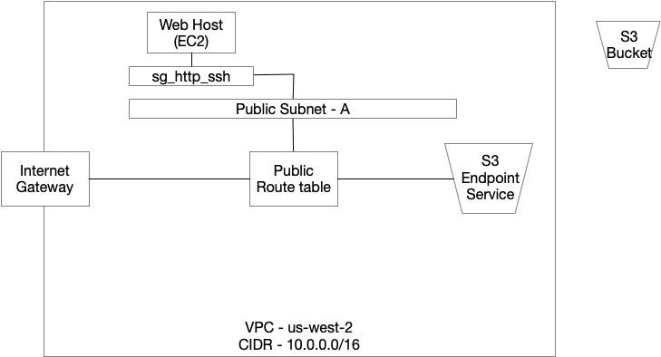

# VPC with EC2

## Overview

## Contains
* VPC
  * /16
* IGW
* Subnet
  * Public subnet
  * /20
* Route Table
  * Public Route table
    * Internet gateway -> 0.0.0.0/0
    * S3 VPC Endpoint
  * default route table
* Security Group
  * HTTP and SSH ingress
* S3
  * Private ACL
  * Server side encryption
    * KMS
* KMS
* EC2 Instance
  * Elastic IP attached

## Inputs

| Name | Description | Type | Default | Required |
|------|-------------|:----:|:-----:|:-----:|
| aws\_region | The AWS region. | string | `"us-west-2"` | no |

## Outputs

| Name | Description |
|------|-------------|
| default\_route\_id | VPC's default route-table ID. |
| igw\_id | ID of the internet gateway. |
| kms\_mykey\_arn | KMS Key ARN. |

| kms\_mykey\_id | KMS Key ID. |
| s3\_state\_bucket\_arn | State bucket ARN. |
| s3\_state\_bucket\_name | State bucket name. |
| sg\_http\_ssh\_id | Security Group ID for HTTP/SSH. |
| subnet\_public\_az\_a\_id | Public Subnet for AZ-A ID. |
| vpc\_cidr\_block | VPC cidr block used. |
| vpc\_id | VPC ID. |
| web\_ami\_id | Web EC2 Instance AMI. |
| web\_eip | Elastic IP fo the web instance. |
